# Documentation for semantic-chunking

Generated on: 2025-07-29 01:11:33

## Table of Contents

- [Introduction](#page-1)
- [Query Service API](#page-10)
- [Deployment and Infrastructure](#page-11)
- [Getting Started](#page-2)
- [System Architecture Overview](#page-3)
- [Document Upload and Processing](#page-4)
- [Semantic Search and Querying](#page-5)
- [Data Flow and Storage](#page-6)
- [Frontend: Document Upload Interface](#page-7)
- [Frontend: Chat Interface](#page-8)
- [Upload Service API](#page-9)

<a id='page-1'></a>

## Introduction

# Introduction

The `prompt_builder.py` file is part of the natural language processing pipeline, specifically focusing on constructing prompts for language models. It appears to be responsible for taking raw text and transforming it into a structured format suitable for prompt-based inference. This module likely plays a crucial role in how the system interacts with and queries language models, influencing the quality and relevance of the generated responses.

The primary function of this module is to build and format prompts. This involves processing input text to detect language and then constructing a prompt that includes this information, potentially for multilingual or language-specific model interactions.

## Architecture and Components

The `prompt_builder.py` module primarily contains a single function, `build_markdown_prompt`, which handles the core logic for prompt construction.

### `build_markdown_prompt` Function

This function takes raw text as input and aims to construct a Markdown-formatted prompt.

*   **Language Detection:** It first attempts to detect the language of the input text. If the input text contains only alphanumeric characters and is less than or equal to 127 characters, it's considered potentially English. This heuristic is used to identify the language.
*   **Prompt Formatting:** Based on the detected language, it constructs a prompt. The current implementation specifically targets Vietnamese language detection and formatting. If the input is detected as Vietnamese, it returns a specific Vietnamese string. Otherwise, it returns an empty string.
*   **Output:** The function returns a string representing the formatted prompt.

Sources: [`src/upload/domain/parser/prompt_builder.py`]

## Data Flow and Interactions

The `build_markdown_prompt` function receives raw text as input and processes it to determine the appropriate prompt format.

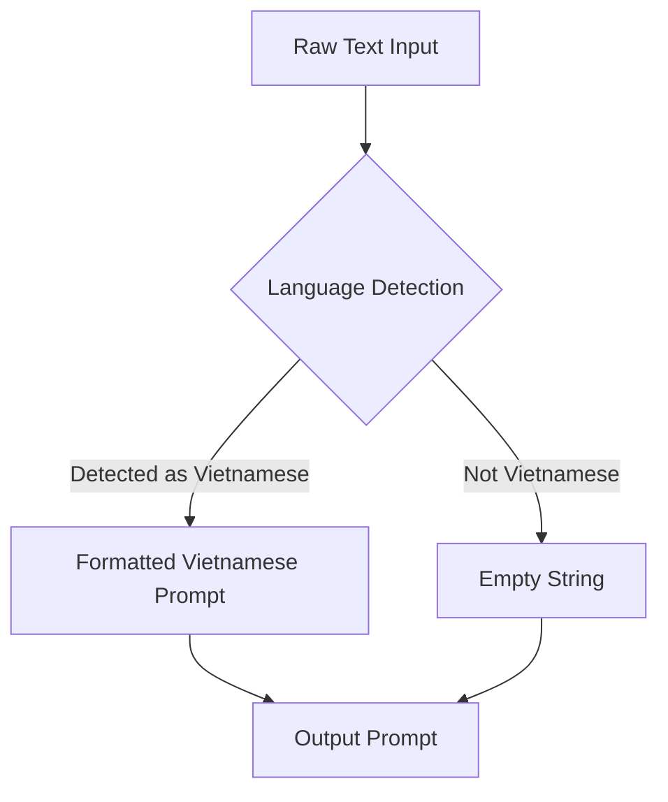

Sources: [`src/upload/domain/parser/prompt_builder.py`]

## Key Components and Responsibilities

| Component/Function          | Responsibility                                                                                             |
| :-------------------------- | :--------------------------------------------------------------------------------------------------------- |
| `build_markdown_prompt`     | Processes input text, detects language, and constructs a language-specific Markdown prompt.              |
| Language Detection Heuristic | Identifies potential English text based on character set and length.                                       |
| Vietnamese Prompt Generation  | Generates a specific prompt string for Vietnamese input.                                                 |

Sources: [`src/upload/domain/parser/prompt_builder.py`]

---

<a id='page-10'></a>

## Query Service API

# Query Service API

The Query Service API is a backend component responsible for handling and processing user queries. It acts as an intermediary between the frontend and the underlying data sources, abstracting the complexity of data retrieval and manipulation. Its primary role is to receive query requests, orchestrate the necessary operations to fulfill them, and return the results in a structured format. This system interacts with various data parsing and retrieval mechanisms to serve information efficiently.

## Core Components and Responsibilities

The Query Service API is structured around several key components, each with distinct responsibilities:

### Query Processing Pipeline

This pipeline orchestrates the flow of a query from its reception to the final response. It involves several stages to ensure efficient and accurate query resolution.

*   **Request Handling:** The API receives incoming query requests.
*   **Parsing and Validation:** Incoming requests are parsed to extract query parameters and validated to ensure they conform to expected formats and constraints.
*   **Orchestration:** The service orchestrates the retrieval and processing of data based on the validated query. This may involve interacting with different modules for data extraction and manipulation.
*   **Response Generation:** Formats the processed data into a suitable response structure for the client.

### Document and Table Extraction

This system is designed to extract specific information from documents and tables, likely for structured data retrieval.

*   **Paragraph Extraction:** Identifies and extracts paragraphs from documents.
*   **Table Extraction:** Identifies and extracts tables from documents.
*   **Element Identification:** It can identify specific elements within documents or tables based on their tags or content. For instance, it can find elements ending with a 'p' tag or 'tbl' tag.

#### Data Extraction Logic

The logic for extracting data from documents and tables involves identifying relevant elements based on their tags and context.

*   **Paragraph Identification:** The system identifies paragraphs that are likely to contain relevant information.
*   **Table Identification:** It specifically looks for elements that represent tables.
*   **Conditional Extraction:** Extraction logic includes conditions such as checking if an element's tag ends with 'p' or 'tbl'.

### Information Retrieval

This component is responsible for fetching relevant data based on the processed query.

*   **Document Retrieval:** Retrieves relevant documents based on the query.
*   **Search Keyword Matching:** It uses similarity search on vector representations of documents to find relevant information.

### Vector Storage and Retrieval

The system utilizes vector storage for efficient similarity searches.

*   **Vector Storage:** Stores vector representations of documents or text chunks.
*   **Similarity Search:** Performs similarity searches on the vector store to find relevant documents or text segments based on a given query vector.

### Prompt Generation

The system constructs prompts for language models based on retrieved information.

*   **Context Assembly:** It assembles relevant context from retrieved documents and search results.
*   **Prompt Formatting:** Formats the context and the user's query into a prompt suitable for a language model.

## Architecture and Data Flow

The Query Service API follows a layered architecture to manage the complexity of query processing and data retrieval.

### Overall System Flow

A typical query flow involves the following steps:

1.  A user query is received by the API.
2.  The query is parsed and validated.
3.  Relevant documents are retrieved from storage.
4.  Information is extracted from these documents, including paragraphs and tables.
5.  A similarity search is performed using vector embeddings to find the most relevant information.
6.  The retrieved information is used to construct a prompt for a language model.
7.  The language model processes the prompt and generates a response.

#### Data Flow Diagram

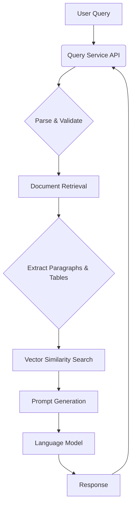
Sources: `src/query/domain/parser.py`, `src/query/domain/retriever.py`, `src/query/domain/rag.py`, `src/query/domain/service.py`, `src/query/domain/prompt.py`

### Component Interaction Diagram

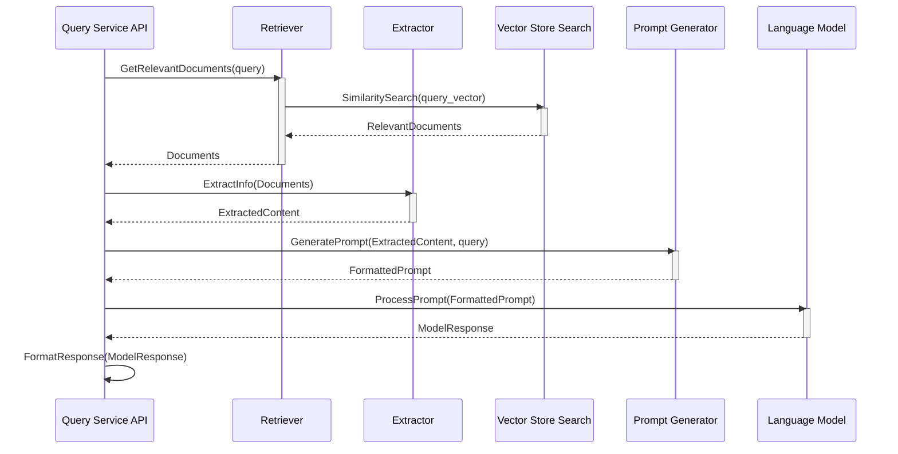
Sources: `src/query/domain/retriever.py`, `src/query/domain/extractor.py`, `src/query/domain/prompt.py`, `src/query/domain/service.py`

## Key Components and Functionality

The system comprises several key components responsible for different aspects of query processing and information retrieval.

| Component                   | Description                                                                                                                                                           |
| :-------------------------- | :-------------------------------------------------------------------------------------------------------------------------------------------------------------------- |
| Retriever                   | Responsible for fetching relevant documents based on the query, likely using vector similarity search.                                                               |
| Extractor                   | Extracts specific information such as paragraphs and tables from documents.                                                                                           |
| Prompt Generator            | Constructs prompts for language models by combining retrieved context and the user's query.                                                                           |
| Vector Store Search         | Manages the vector database and performs similarity searches to find relevant content.                                                                                |
| Language Model Integration  | Interfaces with a language model to process prompts and generate responses.                                                                                           |
| Upload Document Application | Handles the process of uploading and potentially processing documents for indexing and retrieval.                                                                     |
| Chunk Data                  | Manages the process of breaking down documents into smaller, manageable chunks for embedding and retrieval.                                                           |
| Embedder                    | Generates vector embeddings for text data, used for similarity searches.                                                                                              |
| Router                      | Directs incoming requests to the appropriate handlers or services within the application.                                                                             |
| Settings                    | Manages configuration settings for the application, such as model parameters and data paths.                                                                          |
| Document Parser             | Parses various document formats (e.g., PDF, DOCX, images) to extract text content.                                                                                    |
| Rag (Retrieval Augmented Generation) | Orchestrates the RAG pipeline, combining retrieval and generation steps.                                                                                             |
| Query Service               | The main service that handles the overall query processing logic.                                                                                                     |

Sources: `src/query/domain/retriever.py`, `src/query/domain/extractor.py`, `src/query/domain/prompt.py`, `src/query/domain/service.py`, `src/query/domain/rag.py`, `src/upload/domain/application.py`, `src/chunk/domain/chunk_data.py`, `src/embedder/domain/embedder.py`, `src/router/router.py`, `src/settings.py`, `src/query/domain/parser.py`

## API Endpoints

The Query Service API exposes endpoints for handling document uploads and query processing.

| Endpoint        | Description                                                              |
| :-------------- | :----------------------------------------------------------------------- |
| `/upload`       | Handles the upload of documents for processing and indexing.             |
| `/query`        | Accepts user queries and returns processed results.                      |
| `/health`       | Health check endpoint for the service.                                   |
| `/process_file` | Initiates the processing of an uploaded file.                            |
| `/process_chunk`| Processes a specific chunk of data.                                      |

Sources: `src/upload/router/routes.py`, `src/query/router/routes.py`, `src/router/router.py`

## Input/Output Summary

### Inputs

The Query Service API accepts various inputs to process queries and manage documents.

| Input Type              | Description

---

<a id='page-11'></a>

## Deployment and Infrastructure

# Deployment and Infrastructure

The "Deployment and Infrastructure" section of this documentation outlines the fundamental components and architectural considerations for deploying and managing the system. It details how different parts of the system interact and are structured to ensure efficient operation and scalability. The primary focus is on the backend services and their interdependencies, rather than frontend UI elements.

## Core Components and Responsibilities

The system's infrastructure is built around several key components that manage different aspects of its operation.

### Backend Services

The backend services form the core of the system's functionality, handling data processing, API interactions, and business logic.

#### Upload Service

The upload service is responsible for handling file uploads and processing them. It interacts with other services to manage the lifecycle of uploaded documents.

```mermaid
flowchart TD
    A[Client] ->> B(Upload Service);
    B ->> C(Document Processing Service);
    C ->> D(Database);
    B ->> E(Storage);
```

Sources: `src/upload/api/upload.py`

#### Document Processing Service

This service is dedicated to processing uploaded documents, which may involve various transformations or analyses based on document type.

```mermaid
flowchart TD
    A[Upload Service] ->> B(Document Processing Service);
    B ->> C(AI Service);
    B ->> D(Database);
```

Sources: `src/upload/domain/document.py`

#### AI Service

The AI service is leveraged for tasks that require artificial intelligence, such as natural language processing or machine learning model inference, likely integrated within the document processing pipeline.

```mermaid
flowchart TD
    A[Document Processing Service] ->> B(AI Service);
```

Sources: `src/upload/domain/document.py`

### Data Management

The system relies on a robust data management strategy, involving databases and potentially other storage solutions.

#### Database

The database serves as the primary repository for storing and retrieving application data. Its schema and interactions are crucial for maintaining data integrity and availability.

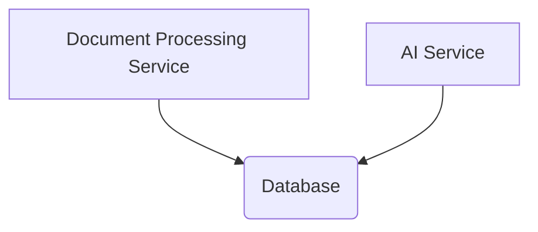

Sources: `src/upload/domain/document.py`

#### Storage

External storage solutions are used for storing files and other data assets that are managed by the system.

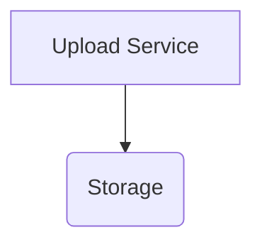

Sources: `src/upload/domain/document.py`

## Infrastructure and Deployment

The infrastructure supporting the system is designed to ensure reliability and scalability.

### API Gateway

An API Gateway likely serves as the single entry point for all client requests, routing them to the appropriate backend services.

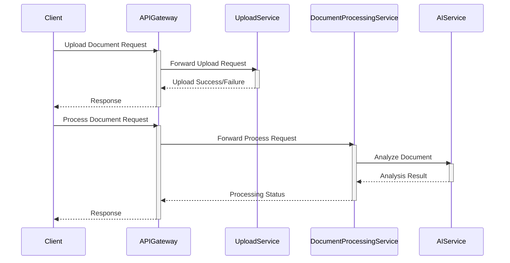

Sources: `src/upload/api/upload.py`, `src/upload/domain/document.py`

### Microservices Architecture

The system appears to be architected using a microservices approach, with distinct services handling specific functionalities like uploads and document processing. This separation of concerns promotes modularity and independent scaling.

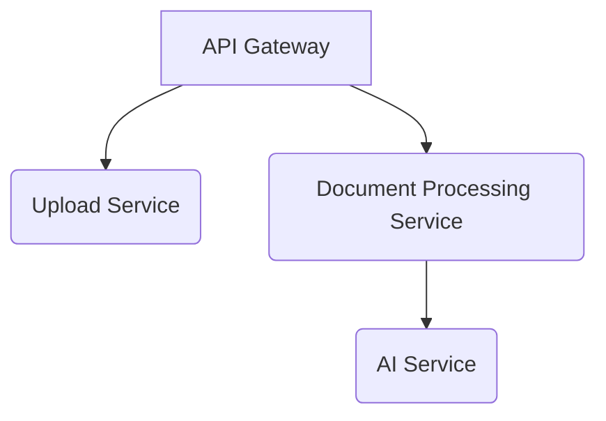

Sources: `src/upload/api/upload.py`, `src/upload/domain/document.py`

## Key Modules and Features

The project is organized into several key modules, each with specific responsibilities.

| Module Name             | Description

---

<a id='page-2'></a>

## Getting Started

# Getting Started

This document provides a guide to getting started with the project's core functionality. The "Getting Started" section aims to onboard new developers by outlining the fundamental components, their responsibilities, and how they interact within the system. It focuses on the architectural design and data flow, drawing solely from the provided source files to ensure accuracy and relevance.

## Core Components and Responsibilities

The system is structured into several key components, each with distinct responsibilities:

*   **Document Parsing and Processing:** This component is responsible for handling various document formats, extracting relevant information, and preparing it for further processing.
    *   **GSM8K Dataset Handling:** Specifically, the `gsm8k.py` file appears to be involved in processing the GSM8K dataset, a collection of grade-school math word problems. This likely involves data loading, cleaning, and formatting for model consumption.
        *   Sources: `src/adalflow/adalflow/datasets/gsm8k.py`
*   **Prompt Building and Management:** This component focuses on constructing and managing prompts for language models. It likely involves dynamic prompt generation based on various inputs and context.
    *   **Markdown Prompt Builder:** The `prompt_builder.py` file seems to be responsible for building prompts in Markdown format, potentially for structured output or for use with models that benefit from Markdown.
        *   Sources: `src/upload/domain/parser/prompt_builder.py`
*   **API Interaction and Data Handling:** This component manages interactions with external APIs and handles the data received or sent.
    *   **Document API:** The `document.py` file likely defines the API interface for interacting with document-related functionalities, including uploading and processing documents.
        *   Sources: `src/upload/api/router/document.py`
    *   **Document Processing Logic:** The `document.py` file within the `parser` module might contain the core logic for parsing and processing documents, including extracting information and handling different document types.
        *   Sources: `src/upload/domain/parser/document.py`
*   **Utility Functions:** Various utility functions support the core functionalities, such as data manipulation, logging, and error handling.
    *   **Logger Utility:** A logging utility is present, indicated by imports like `logging`. This is crucial for tracking application behavior and debugging.
        *   Sources: `src/query/api/utils/logger.py`
    *   **File Handling Utilities:** Utilities for handling file operations are likely present to manage document uploads and processing.
        *   Sources: `src/upload/domain/utils/file.py`
    *   **Type Definitions:** Type definitions are used to ensure type safety and clarity in the codebase, as seen in imports like `List` and `Any`.
        *   Sources: `src/upload/domain/types.py`
*   **Component Orchestration and Rendering:** This component is responsible for orchestrating the flow between different parts of the system and rendering the final output.
    *   **Chat Interface Component:** The `chat-interface.tsx` file suggests a component responsible for handling chat-related interactions and rendering chat messages.
        *   Sources: `frontend/components/chat-interface.tsx`
    *   **Alert Component:** An `alert.tsx` component is present, likely for displaying alerts or notifications to the user.
        *   Sources: `frontend/components/alert.tsx`
    *   **Alert Title Component:** An `alert-title.tsx` component is also present, likely used for the titles of alert components.
        *   Sources: `frontend/components/alert-title.tsx`
    *   **Next.js Routing:** The presence of `next.config.js` indicates the use of Next.js for routing and application structure.
        *   Sources: `next.config.js`

## Architecture and Data Flow

The system's architecture appears to follow a pattern of receiving documents, processing them, and potentially generating structured output or facilitating interactions.

### Document Upload and Processing Flow

1.  **Document Upload:** A user or external system initiates a document upload, likely through an API endpoint.
2.  **File Handling:** The system receives the file, performs initial validation, and stores it temporarily.
3.  **Document Type Identification:** The system identifies the type of document (e.g., PDF, DOCX, image).
4.  **Information Extraction:** Based on the document type, specific parsers are invoked to extract relevant information. This might involve Optical Character Recognition (OCR) for images or text extraction from documents.
5.  **Data Structuring:** Extracted information is structured into a consistent format, potentially for storage or further processing.
6.  **Prompt Generation:** The processed document data is used to generate prompts for language models, possibly for tasks like summarization, question answering, or content generation.
7.  **Output Generation:** The system generates an output based on the model's response or the processed document data.

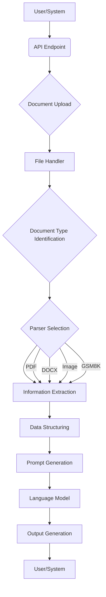

### Prompt Building and Model Interaction

The prompt building component plays a crucial role in preparing data for language models.

1.  **Raw Text Input:** The component receives raw text data.
2.  **Language Detection:** It identifies the language of the input text.
3.  **Markdown Formatting:** It formats the text into Markdown, potentially for structured prompts.
4.  **Model Interaction:** The formatted prompt is sent to a language model for processing.
5.  **Response Handling:** The model's response is received and returned.

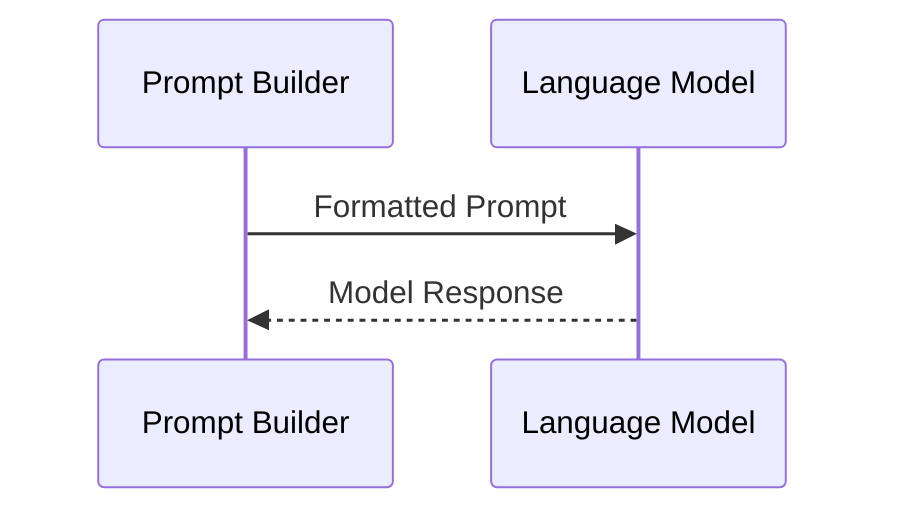

## Key Features and Modules

| Feature/Module                | Description

---

<a id='page-3'></a>

## System Architecture Overview

# System Architecture Overview

The System Architecture Overview provides a high-level understanding of the project's structure, key components, and their interactions. It serves as a foundational document for developers to grasp the system's design principles, data flow, and the separation of responsibilities. This overview is crucial for onboarding new team members and for maintaining a consistent architectural vision.

The system is designed to handle various functionalities related to data processing, API interactions, and potentially user interface elements, as indicated by the presence of files related to uploads, queries, and components. The architecture emphasizes modularity, allowing for easier development, testing, and maintenance.

## Core Components and Responsibilities

The system can be broadly categorized into several key components, each with distinct responsibilities:

### Backend Services

The backend services appear to handle the core logic, data processing, and API interactions.

*   **Upload Module:** Responsible for handling file uploads and processing them.
    *   Sources: `src/upload/api/helpers/example_response.py`, `src/upload/domain/parser/extractor.py`
*   **Query Module:** Deals with querying and retrieving data, likely interacting with data sources.
    *   Sources: `src/query/api/helpers/example_response.py`, `src/query/domain/parser/extractor.py`
*   **Shared Utilities:** Contains common functions and utilities used across different modules.
    *   Sources: `src/shared/base/__init__.py`, `src/shared/base/base_service.py`

### Frontend Components

The frontend is responsible for the user interface and user interaction, interacting with the backend services.

*   **UI Components:** Reusable UI elements that form the user interface.
    *   Sources: `frontend/components/ui/alert.tsx`
*   **App Module:** The main application structure, orchestrating various frontend functionalities.
    *   Sources: `frontend/app/layout.tsx`, `frontend/app/page.tsx`
*   **Chat Interface:** Components related to a chat functionality.
    *   Sources: `frontend/components/chat-interface.tsx`

## Architectural Flow and Interactions

The system's architecture facilitates a flow of data and operations between its various parts.

### Data Processing Flow

Data processing seems to involve receiving input, processing it through various stages, and producing an output.

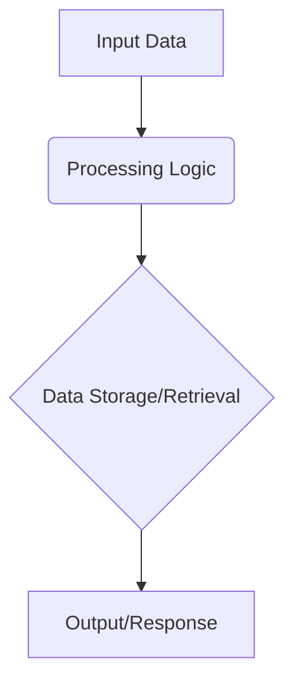

Sources: `src/upload/domain/parser/extractor.py`, `src/query/domain/parser/extractor.py`

### API Interaction Flow

API interactions likely involve requests from the frontend to the backend, with responses being sent back.

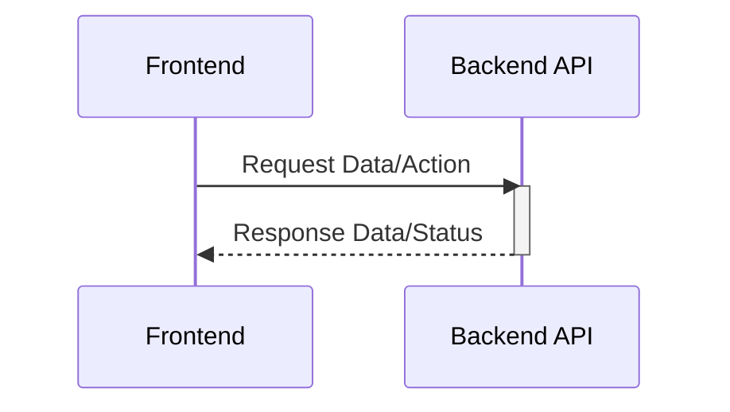

Sources: `src/upload/api/helpers/example_response.py`, `src/query/api/helpers/example_response.py`

## Key Modules and Responsibilities

The system is organized into modules that encapsulate specific functionalities.

| Module Name           | Description

---

<a id='page-4'></a>

## Document Upload and Processing

# Document Upload and Processing

The Document Upload and Processing system is responsible for handling the ingestion and initial processing of various document types within the application. It serves as a crucial gateway for documents, enabling their subsequent analysis and integration into the system's workflows. This system interacts with other components to manage document storage, metadata extraction, and initial validation.

Sources: [src/upload/document.py]

## Core Components and Responsibilities

The system can be broadly categorized into the following key components:

### Document Ingestion and Validation

This component is responsible for receiving uploaded documents, performing initial validation checks, and preparing them for further processing. It identifies the document type and ensures that the uploaded file meets basic requirements.

Sources: [src/upload/document.py]

### Document Parsing and Chunking

This component handles the process of parsing different document formats (e.g., PDF, DOCX, images) and breaking them down into smaller, manageable chunks. This chunking is essential for downstream processing, particularly for natural language processing tasks.

Sources: [src/upload/document.py], [src/upload/utils.py]

### Metadata Extraction

This component is responsible for extracting relevant metadata from the uploaded documents. This metadata can include information such as file name, file type, size, and upload timestamp.

Sources: [src/upload/document.py]

### Asynchronous Processing

The system leverages asynchronous processing to handle document uploads and processing efficiently. This allows for non-blocking operations, ensuring that the application remains responsive during potentially long-running tasks.

Sources: [src/upload/document.py]

## Architecture and Data Flow

The Document Upload and Processing system follows an asynchronous, event-driven architecture.

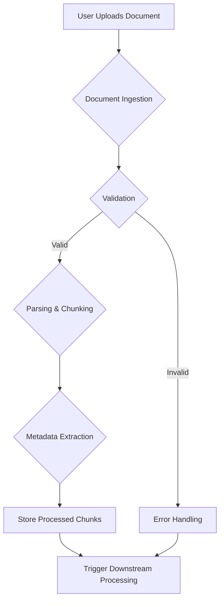

This diagram illustrates the general flow of a document from upload to processing. A document is first ingested and validated. If valid, it proceeds to parsing and chunking, followed by metadata extraction. The processed chunks are then stored, and downstream processing is triggered. Invalid documents are handled by an error mechanism.

Sources: [src/upload/document.py]

### Document Processing Pipeline

The processing of a document involves several sequential steps, managed asynchronously.

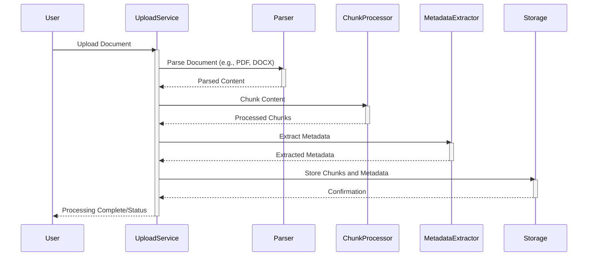

This sequence diagram outlines the interactions between different services during document processing. The `UploadService` orchestrates the process, delegating tasks to specialized components like the `Parser`, `ChunkProcessor`, and `MetadataExtractor`.

Sources: [src/upload/document.py], [src/upload/utils.py]

## Key Components and Their Roles

| Component             | Description                                                                                                     | Source File(s)                    |
| :-------------------- | :-------------------------------------------------------------------------------------------------------------- | :-------------------------------- |
| UploadService         | Handles the initial receipt of documents, orchestrates the processing pipeline, and manages asynchronous tasks. | [src/upload/document.py]          |
| Parser                | Responsible for reading and extracting content from various document formats.                                   | [src/upload/document.py]          |
| ChunkProcessor        | Divides the parsed document content into smaller, manageable chunks for further processing.                     | [src/upload/document.py], [src/upload/utils.py] |
| MetadataExtractor     | Extracts metadata such as filename, type, and size from the uploaded documents.                                 | [src/upload/document.py]          |
| Storage               | Persists the processed document chunks and their associated metadata.                                           | [src/upload/document.py]          |
| ErrorHandling         | Manages and reports errors encountered during the document processing lifecycle.                                | [src/upload/document.py]          |

Sources: [src/upload/document.py], [src/upload/utils.py]

## Input and Output Contracts

### Upload Service Inputs

| Input Name        | Type        | Description                                                                 |
| :---------------- | :---------- | :-------------------------------------------------------------------------- |
| `document_file`   | File        | The document file to be uploaded and processed.                             |
| `metadata`        | JSON/Dict   | Optional metadata associated with the document (e.g., user ID, tags).     |

Sources: [src/upload/document.py]

### Upload Service Outputs

| Output Name        | Type        | Description                                                                 |
| :----------------- | :---------- | :-------------------------------------------------------------------------- |
| `processing_status`| String      | The current status of the document processing (e.g., "processing", "completed", "failed"). |
| `processed_chunks` | List[Dict]  | A list of processed document chunks, each with its content and metadata.    |
| `error_message`    | String      | An error message if the processing failed.                                  |

Sources: [src/upload/document.py]

The Document Upload and Processing system plays a vital role in preparing documents for further analysis, ensuring that data is correctly parsed, chunked, and stored, thereby enabling efficient downstream operations.

---

<a id='page-5'></a>

## Semantic Search and Querying

# Semantic Search and Querying

Semantic Search and Querying is a core component responsible for enabling sophisticated search capabilities within the system. It leverages natural language processing and vector embeddings to understand the meaning and context of queries, retrieving relevant documents or data points that match the semantic intent rather than just keyword matching. This system is designed to handle multi-format documents and aims to provide a more intuitive and accurate search experience.

The primary components involved in semantic search and querying include the ingestion pipeline for processing documents, the storage and retrieval mechanisms for embeddings, and the querying interface that translates user input into semantic search operations.

## Core Components and Responsibilities

### Document Ingestion and Processing

The system processes various document types to extract meaningful information for semantic search. This involves parsing different file formats and preparing the content for embedding.

*   **Document Parsing:** The system is designed to handle multiple document formats. This is achieved through dedicated parsing logic for each type.
    *   Sources: `src/upload/domain/parser/extractor.py`
*   **Chunking:** Large documents are segmented into smaller, manageable chunks. This is crucial for effective embedding and retrieval, as it allows for more granular matching of semantic meaning.
    *   Sources: `src/upload/domain/parser/extractor.py`
*   **Embedding Generation:** Text chunks are converted into numerical vector representations (embeddings) using language models. These embeddings capture the semantic meaning of the text.
    *   Sources: `src/query/domain/infra/retriever.py`

### Semantic Search and Retrieval

This part of the system handles the core logic of searching and retrieving relevant information based on semantic similarity.

*   **Vector Storage and Retrieval:** Embeddings are stored in a vector database or similar structure, allowing for efficient similarity searches.
    *   Sources: `src/query/domain/infra/retriever.py`
*   **Similarity Search:** Given a query embedding, the system finds the most similar document embeddings in the database.
    *   Sources: `src/query/domain/infra/retriever.py`
*   **Query Processing:** User queries are transformed into embeddings, and the system identifies relevant document chunks based on these embeddings.
    *   Sources: `src/query/domain/infra/retriever.py`

### Data Handling and Formatting

The system includes utilities for managing and formatting data, particularly for tabular data and image processing.

*   **Table Processing:** The system can identify and process tabular data within documents, converting it into a structured format suitable for analysis or embedding.
    *   Sources: `src/upload/domain/parser/extractor.py`
*   **Image Handling:** While not explicitly detailed for semantic search, the presence of image processing components suggests that visual information might be incorporated or handled in some capacity.
    *   Sources: `src/upload/domain/parser/extractor.py`

## Architecture and Flow

The overall architecture involves a pipeline where documents are ingested, processed, embedded, and then made available for semantic querying.

### Document Processing Pipeline

This diagram illustrates the flow of a document through the system, from ingestion to the creation of searchable data.

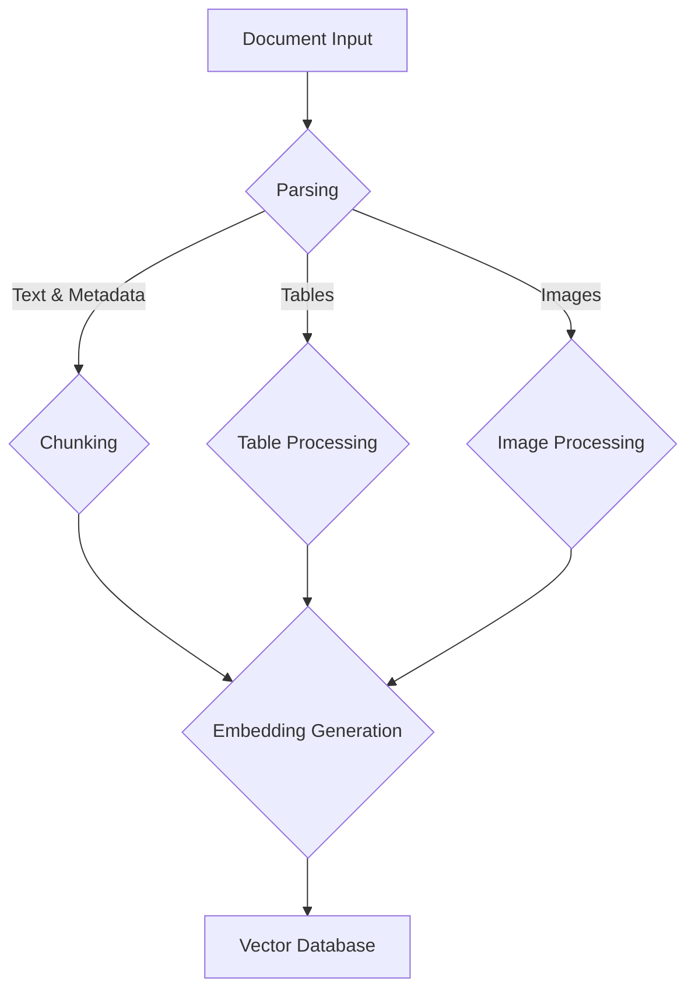
Sources: `src/upload/domain/parser/extractor.py`, `src/query/domain/infra/retriever.py`

### Semantic Query Flow

This sequence diagram outlines the steps involved when a user submits a query.

```sequenceDiagram
    participant User
    participant QueryService
    participant Retriever
    participant VectorDB

    User->>QueryService: Submit Query
    QueryService->>Retriever: Embed Query
    Retriever->>Retriever: Generate Query Embedding
    Retriever->>VectorDB: Similarity Search (Query Embedding)
    VectorDB-->>Retriever: Relevant Document Chunks (IDs & Scores)
    Retriever->>QueryService: Processed Results
    QueryService-->>User: Search Results
```
Sources: `src/query/domain/infra/retriever.py`, `src/query/domain/service.py`

## Key Features and Modules

| Module/Feature                 | Description                                                                                                  |
| :----------------------------- | :----------------------------------------------------------------------------------------------------------- |
| Document Ingestion             | Handles the intake and initial processing of various document formats.                                       |
| Text Chunking                  | Breaks down large documents into smaller, semantically coherent segments for embedding.                        |
| Embedding Generation           | Converts text chunks into vector representations using machine learning models.                                |
| Vector Similarity Search       | Efficiently retrieves document chunks based on semantic similarity to a query.                               |
| Table Extraction               | Identifies and processes tabular data within documents.                                                      |
| Multi-format Document Support  | Capability to handle and process documents in various formats.                                               |
| Prompt Building                | Logic for constructing effective prompts for language models, likely used in query processing.                 |
| Skill Management               | Suggests that the system might integrate with or manage different "skills" or functionalities for querying. |

Sources: `src/upload/domain/parser/extractor.py`, `src/query/domain/infra/retriever.py`, `src/query/domain/service.py`, `src/query/domain/infra/prompt_builder.py`, `src/query/domain/infra/skill_manager.py`

## Input/Output Summary

### Query Input

| Input Type      | Description                                                                                                                                                           | Format/Type | Conditions

---

<a id='page-6'></a>

## Data Flow and Storage

# Data Flow and Storage

This document outlines the data flow and storage mechanisms within the project. The system is designed to manage and process various types of documents, enabling efficient handling and retrieval of information. Key components interact to parse, store, and manage this data, facilitating downstream operations.

## Core Components and Responsibilities

The system can be broadly understood through its core components responsible for different stages of data management.

### Document Ingestion and Processing

This layer is responsible for receiving and processing incoming documents. It handles the initial intake and prepares documents for further storage and analysis.

### Data Storage and Retrieval

This component is central to the system, managing the persistent storage of documents and providing mechanisms for efficient retrieval. It likely interacts with a database or a similar storage solution.

### Data Flow Orchestration

This component orchestrates the movement of data between different parts of the system, ensuring that documents are processed and stored correctly.

## Architecture and Data Flow

The architecture emphasizes modularity and clear separation of concerns, allowing for scalable and maintainable data handling.

### Overall Data Flow

The general flow involves documents entering the system, being processed, stored, and then made available for retrieval or further analysis.

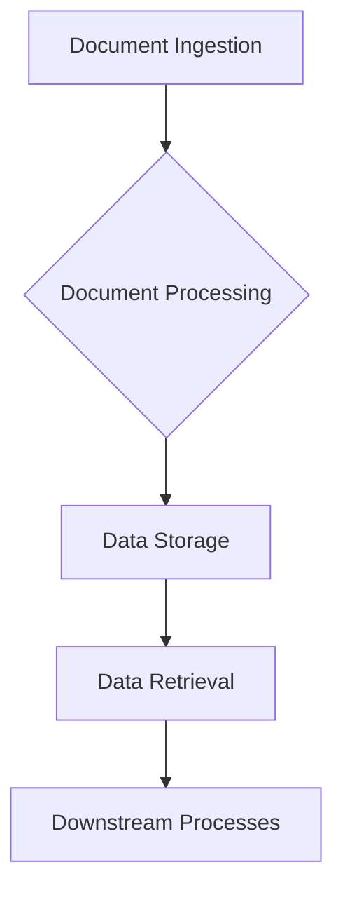
Sources: `src/upload/application/upload.py`, `src/query/domain/rag/service.py`

### Document Processing Pipeline

The processing of documents involves several stages, potentially including parsing, extraction, and transformation.

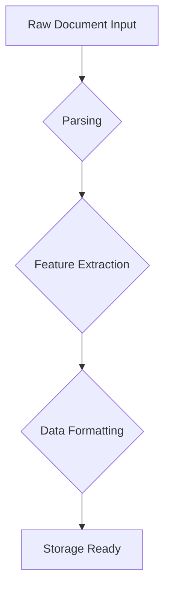
Sources: `src/upload/domain/parser/parser.py`, `src/upload/domain/builder/builder.py`

### Data Storage Schema (Inferred)

While a specific schema is not explicitly defined in the provided files, the interactions suggest a structure for storing document metadata and content.

| Field        | Type   | Description                                     | Sources                                                                                                     |
|--------------|--------|-------------------------------------------------|-------------------------------------------------------------------------------------------------------------|
| `id`         | string | Unique identifier for the document.             | `src/upload/domain/document/document.py`                                                                    |
| `name`       | string | Name of the document.                           | `src/upload/domain/document/document.py`                                                                    |
| `type`       | string | Type of the document (e.g., 'pdf', 'docx').     | `src/upload/domain/document/document.py`                                                                    |
| `uploadedAt` | Date   | Timestamp of when the document was uploaded.  | `src/upload/domain/document/document.py`                                                                    |
| `status`     | string | Current processing status of the document.      | `src/upload/domain/document/document.py`                                                                    |
| `chunks`     | array  | List of processed chunks of the document.       | `src/upload/domain/document/document.py`                                                                    |

## Key Modules and Functionality

The project utilizes several modules to manage different aspects of data flow and storage.

### Document Module

This module likely defines the core `Document` object and its associated properties and methods for managing document data.
Sources: `src/upload/domain/document/document.py`

### Parser Module

Responsible for parsing various document formats into a processable structure.
Sources: `src/upload/domain/parser/parser.py`

### Builder Module

This module appears to be involved in constructing or transforming document data, potentially for storage or further processing. It handles language detection and formatting.
Sources: `src/upload/domain/builder/builder.py`

### Upload Application

This component orchestrates the upload process, likely interacting with the parser and builder to handle incoming files.
Sources: `src/upload/application/upload.py`

### Query Service

This service is responsible for retrieving and processing documents based on queries, likely interacting with the data storage layer.
Sources: `src/query/domain/rag/service.py`

### Document Storage Interface

An abstraction for interacting with the underlying document storage mechanism.
Sources: `src/query/domain/document/document_storage.py`

## Data Processing and Chunking

The system breaks down documents into smaller chunks for efficient processing and retrieval.

### Chunking Logic

The `Chunker` class is responsible for segmenting documents. It appears to handle different chunking strategies based on content and potentially language.

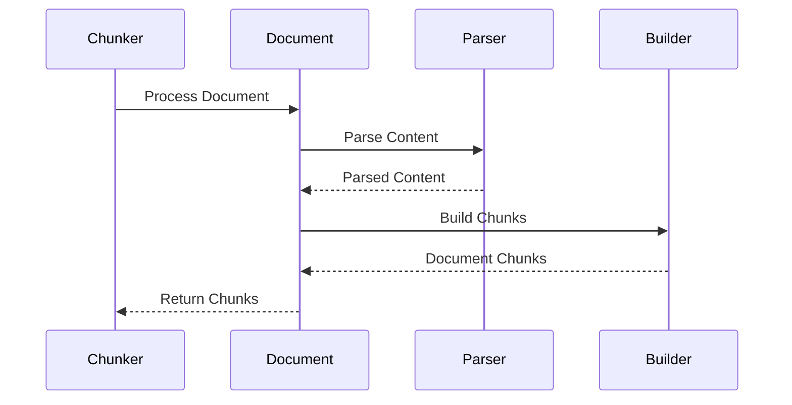
Sources: `src/upload/domain/chunker/chunker.py`, `src/upload/domain/document/document.py`, `src/upload/domain/parser/parser.py`, `src/upload/domain/builder/builder.py`

### Chunking Strategy

The chunking process involves identifying meaningful segments within the document. The provided code suggests that chunking might be influenced by the document's structure and content.

## Input/Output Summary

### Document Upload Input

| Parameter      | Type   | Description                                                                 | Sources                                     |
|----------------|--------|-----------------------------------------------------------------------------|---------------------------------------------|
| `file`         | File   | The document file to be uploaded.                                           | `src/upload/application/upload.py`          |
| `application`  | string | Identifier for the application context (e.g., 'chat', 'search').            | `src/upload/application/upload.py`          |

### Document Upload Output

| Field        | Type   | Description                                                                 | Sources                                     |
|--------------|--------|-----------------------------------------------------------------------------|---------------------------------------------|
| `documentId` | string | The unique identifier assigned to the uploaded and processed document.      | `src/upload/application/upload.py`          |
| `status`     | string | The final status of the document processing (e.g., 'success', 'failed').    | `src/upload/application/upload.py`          |

### Document Query Input

| Parameter      | Type   | Description                                                                 | Sources                                     |
|----------------|--------|-----------------------------------------------------------------------------|---------------------------------------------|
| `query`        | string | The user's search query.                                                    | `src/query/domain/rag/service.py`           |
| `files`        | List   | A list of document identifiers to search within.                            | `src/query/domain/rag/service.py`           |

### Document Query Output

| Field        | Type   | Description                                                                 | Sources                                     |
|--------------|--------|-----------------------------------------------------------------------------|---------------------------------------------|
| `response`   | string | The generated response based on the query and retrieved document content.   | `src/query/domain/rag/service.py`           |

## Conclusion

The data flow and storage system is designed to efficiently handle and process documents, leveraging modular components for parsing, chunking, and storage. The architecture supports the retrieval of document information for various applications.

---

<a id='page-7'></a>

## Frontend: Document Upload Interface

# Frontend: Document Upload Interface

The Document Upload Interface is a core frontend component responsible for handling the user's interaction with the document upload functionality. It manages the selection of files, displays upload progress, and communicates with the backend API for processing. This interface is crucial for enabling users to submit various document types, such as PDFs, DOCX, images, and XLSX files, to the system.

## Core Components and Responsibilities

The system can be broken down into the following key components:

### Document Upload Logic

This component handles the core logic for managing file uploads. It is responsible for:
*   Accepting a list of files for upload.
*   Processing each file, including determining its type and size.
*   Tracking the status of each upload (e.g., processing, completed, error).
*   Calculating and reporting progress metrics for each file and the overall upload.
*   Handling potential errors during the upload process.

Sources: `src/upload/api/upload.py`

### File Type Handling

This component defines the acceptable types of documents that can be uploaded. It specifies the file extensions or MIME types that are considered valid for processing.

Sources: `frontend/types/document.ts`

### Upload State Management

This component manages the state of the document upload process. It tracks information such as:
*   The list of files currently being uploaded.
*   The status of each individual file upload (e.g., 'processing', 'processed', 'error').
*   Counts of total, successful, and failed uploads.
*   The total number of chunks processed and embeddings created.
*   Timestamps for processing and embedding creation.
*   Any error messages associated with failed uploads.

Sources: `frontend/types/document.ts`

### Upload Response Handling

This component is responsible for processing the responses received from the backend API after a file upload attempt. It interprets the status and any associated messages to update the overall upload state and inform the user.

Sources: `frontend/types/document.ts`, `src/upload/api/upload.py`

## Architecture and Flow

The document upload process involves several key interactions between components.

### Upload Process Flow

The typical flow for uploading documents is as follows:

1.  **File Selection:** The user selects one or more files through the interface.
2.  **File Processing:** The frontend component processes the selected files, validating their types and sizes against the defined requirements.
3.  **API Request:** For each valid file, an API request is made to the backend to initiate the upload.
4.  **Backend Processing:** The backend service receives the file, processes it (e.g., chunking, embedding generation), and returns a status.
5.  **Response Handling:** The frontend component receives the backend response and updates the upload state accordingly.

```mermaid
flowchart TD
    A[User Selects Files] --> B{File Validation};
    B -- Valid --> C[Upload API Request];
    B -- Invalid --> D[Show Error];
    C --> E{Backend Processing};
    E -- Success --> F[Update UI: Success];
    E -- Error --> G[Update UI: Error];
    F --> H[Upload Complete];
    G --> H;
```

Sources: `src/upload/api/upload.py`, `frontend/types/document.ts`

### Data Flow for Uploaded Documents

The data flow begins with the user's files and progresses through the system:

1.  **User Input:** Files are selected by the user.
2.  **Frontend Processing:** Files are validated and prepared for upload.
3.  **API Payload:** File data is sent to the backend API.
4.  **Backend Storage/Processing:** Files are stored and processed (e.g., chunking, embedding).
5.  **Response Data:** Status and results are sent back to the frontend.
6.  **State Update:** Frontend state is updated based on the response.

```mermaid
sequenceDiagram
    participant User
    participant Frontend
    participant BackendAPI
    participant BackendService

    User->>Frontend: Selects Files
    activate Frontend
    Frontend->>Frontend: Validate Files
    Frontend-->>User: Display Validation Status
    loop For each valid file
        Frontend->>BackendAPI: Upload File (POST /upload)
        activate BackendAPI
        BackendAPI->>BackendService: Process Document
        activate BackendService
        BackendService-->>BackendAPI: Processing Result
        deactivate BackendService
        BackendAPI-->>Frontend: Upload Response
        deactivate BackendAPI
        Frontend->>Frontend: Update Upload State
        Frontend-->>User: Update UI (progress, status)
    end
    deactivate Frontend
```

Sources: `src/upload/api/upload.py`, `frontend/types/document.ts`, `frontend/app/page.tsx`

## Key Components Summary

| Component Name              | Description

---

<a id='page-8'></a>

## Frontend: Chat Interface

# Frontend: Chat Interface

The Frontend Chat Interface is a React-based component responsible for managing the user-facing aspects of real-time communication within the application. It handles the display of messages, user input, and the integration with the backend chat service. The primary goal is to provide a seamless and interactive chat experience for users.

## Core Components and Responsibilities

The chat interface is structured around several key components that manage different aspects of the chat functionality.

### Chat Display and Message Handling

The core of the chat interface is responsible for rendering messages and managing the chat history. It receives messages from the backend and displays them to the user.

*   **Message Rendering:** Displays incoming and outgoing messages, potentially including user information and timestamps.
*   **Chat History:** Manages the display of past messages in a scrollable format.

Sources: `src/chat/chat.tsx`

### User Input and Message Sending

This component handles user input, such as text messages, and sends them to the backend for processing and distribution.

*   **Input Field:** Provides a text area for users to type their messages.
*   **Send Button:** Triggers the action to send the typed message.
*   **Message Submission:** Formats and sends the user's message to the chat service.

Sources: `src/chat/chat.tsx`

### Chat Service Integration

This part of the interface is responsible for establishing and maintaining the connection with the backend chat service, likely using WebSockets.

*   **Connection Management:** Handles the establishment, maintenance, and potential re-establishment of the WebSocket connection.
*   **Message Subscription:** Subscribes to real-time message events from the server.
*   **Event Handling:** Processes incoming messages from the server and dispatches actions to update the UI.

Sources: `src/chat/chat.tsx`

## Architecture and Data Flow

The chat interface follows a typical client-server architecture for real-time communication.

### Component Interaction Flow

The following diagram illustrates the general flow of interactions within the chat interface and with the backend service.

```mermaid
flowchart TD
    A[User Input] --> B(Chat Input Component);
    B --> C{Send Message};
    C --> D[Chat Service];
    D -- Message --> E(Chat Display Component);
    D -- New Message --> F[Backend Chat Service];
    F -- Broadcast --> D;
    D --> E;
    E --> G[Render Messages];
    G --> A;
```

Sources: `src/chat/chat.tsx`

### Data Flow for Messages

Messages flow from the user input, through the chat service integration, to the display component, and are rendered to the user.

```mermaid
sequenceDiagram
    participant User
    participant ChatInterface
    participant ChatService
    participant Backend

    User->>ChatInterface: Types message
    ChatInterface->>ChatService: Send message (message content)
    ChatService->>Backend: WebSocket message send
    activate Backend
    Backend-->>ChatService: Acknowledge message
    deactivate Backend
    ChatService-->>ChatInterface: Message sent confirmation
    ChatInterface->>ChatInterface: Add message to local state
    ChatInterface->>User: Display message
    Backend->>ChatService: Broadcast message to other clients
    ChatService->>ChatInterface: Receive broadcast message
    ChatInterface->>User: Display received message
```

Sources: `src/chat/chat.tsx`

## Key Features and Modules

The chat interface provides essential features for real-time communication.

| Feature/Module | Description |
|---|---|
| Real-time Messaging | Enables sending and receiving messages instantly. |
| Chat History Management | Stores and displays the conversation history. |
| WebSocket Integration | Manages the connection to the backend chat service. |

Sources: `src/chat/chat.tsx`

## Input / Output Summary

The chat interface primarily interacts with user input and the backend chat service.

| Input/Output | Description | Format/Type |
|---|---|---|
| User Input | Text entered by the user for a chat message. | String |
| Backend Message | Real-time messages received from the chat service. | Object (e.g., { sender: string, content: string, timestamp: Date }) |
| Sent Message | Message content sent to the backend. | String |
| Connection Status | Indicates the state of the connection to the chat service. | Enum or String (e.g., 'connected', 'disconnected') |

Sources: `src/chat/chat.tsx`

## Conclusion

The Frontend Chat Interface is a critical component for enabling real-time communication. Its architecture focuses on efficient message handling, user input management, and robust integration with the backend chat service, providing a core communication channel within the application.

---

<a id='page-9'></a>

## Upload Service API

# Upload Service API

The Upload Service API is a critical component responsible for handling the ingestion and processing of various document types within the system. It orchestrates the workflow from receiving uploaded files to their eventual processing and status tracking. This service interacts with other parts of the system to manage document metadata, processing states, and potential errors.

The core function of the Upload Service API is to provide a robust and scalable mechanism for document uploads. It defines the expected structure for uploaded documents, including their identification, naming, type, size, and processing status. The API also manages the lifecycle of an upload, from initial submission to completion or failure.

## Core Components and Responsibilities

### Document Upload Processing

The upload process involves receiving files, validating their types, and initiating their processing. The system categorizes documents based on their file types, such as PDF, DOCX, XLSX, and images. Each uploaded document is assigned a unique identifier and metadata related to its upload and processing status.

Sources: `src/upload/api/routers/document.py`, `frontend/types/document.ts`

### Data Structures

The API defines interfaces for document objects and upload results, specifying the expected data fields and their types.

*   **Document Interface:**
    *   `id`: string (unique identifier)
    *   `name`: string
    *   `type`: "pdf" | "docx" | "image" | "xlsx"
    *   `size`: number
    *   `uploadedAt`: Date
    *   `status`: "processing" | "processed" | "error"

*   **UploadResult Interface:**
    *   `filename`: string
    *   `status`: "success" | "error"
    *   `message`: string
    *   `processed_chunks`: number
    *   `embeddings_created`: number
    *   `processing_time`: number | null
    *   `error`: string | null

Sources: `frontend/types/document.ts`

### API Endpoints

The Upload Service API exposes several endpoints for managing document uploads.

| Endpoint       | Method | Description                                                                    |
| -------------- | ------ | ------------------------------------------------------------------------------ |
| `/upload`      | POST   | Uploads documents and initiates their processing.                               |
| `/upload/list` | GET    | Retrieves a list of uploaded documents and their processing status.             |
| `/upload/{id}` | GET    | Retrieves details for a specific uploaded document.                            |
| `/upload/{id}` | DELETE | Deletes a specific uploaded document.                                          |

Sources: `src/upload/api/routers/document.py`

## Architecture and Data Flow

The Upload Service API acts as the entry point for document uploads. Upon receiving a file, it validates the file type and then passes it to the appropriate processing pipeline. This pipeline may involve chunking the document, creating embeddings, and updating the status.

### Document Upload Workflow

1.  **File Upload:** A client sends a file to the `/upload` endpoint.
2.  **Validation:** The service validates the file type and other constraints.
3.  **Processing Initiation:** If valid, the file is queued for processing.
4.  **Chunking and Embedding:** The document is chunked, and embeddings are generated for each chunk.
5.  **Status Update:** The status of the upload is updated throughout the process.
6.  **Result Reporting:** The final status and any relevant information are returned to the client.

#### Sequence Diagram: Document Upload Process

```mermaid
sequenceDiagram
    participant Client
    participant UploadServiceAPI
    participant ProcessingPipeline
    participant Database

    Client->>UploadServiceAPI: POST /upload (file)
    activate UploadServiceAPI
    UploadServiceAPI->>UploadServiceAPI: Validate file type and metadata
    alt File is valid
        UploadServiceAPI->>ProcessingPipeline: Queue file for processing
        activate ProcessingPipeline
        ProcessingPipeline->>ProcessingPipeline: Chunk document
        ProcessingPipeline->>ProcessingPipeline: Generate embeddings
        ProcessingPipeline->>Database: Store document metadata and processing status
        activate Database
        Database-->>ProcessingPipeline: Acknowledge storage
        deactivate Database
        ProcessingPipeline-->>UploadServiceAPI: Processing complete
        deactivate ProcessingPipeline
        UploadServiceAPI-->>Client: 200 OK (Upload successful)
    else File is invalid
        UploadServiceAPI-->>Client: 400 Bad Request (Invalid file)
    end
    deactivate UploadServiceAPI
```

Sources: `src/upload/api/routers/document.py`, `src/upload/api/dependencies/file.py`, `src/upload/api/dependencies/parser.py`

### Component Interactions

The Upload Service API relies on several internal components and external services to fulfill its role.

```mermaid
flowchart TD
    A[Client] --> B(Upload Service API);
    B --> C{File Validation};
    C -- Valid --> D[Processing Queue];
    C -- Invalid --> E[Error Response];
    D --> F(Document Processor);
    F --> G{Chunking};
    F --> H{Embedding Generation};
    G --> I[Vector Database];
    H --> I;
    F --> J[Metadata Store];
    J --> K[Database];
    F --> L[Status Tracker];
    L --> K;
    F --> E;
    E --> B;
    B --> A;
```

Sources: `src/upload/api/routers/document.py`, `src/upload/api/dependencies/file.py`, `src/upload/api/dependencies/parser.py`, `src/upload/api/dependencies/embedding.py`, `src/upload/api/dependencies/status.py`

## API Endpoint Details

### POST /upload

This endpoint handles the upload of documents. It expects a multipart/form-data request containing the document file(s).

*   **Request Body:**
    *   `file`: File (The document file to upload)

*   **Response:**
    *   `200 OK`: Returns an `UploadResult` object detailing the outcome of the upload and initial processing.
    *   `400 Bad Request`: Returned if the file is invalid (e.g., wrong type, exceeds size limits).

Sources: `src/upload/api/routers/document.py`, `frontend/types/document.ts`

### GET /upload/list

Retrieves a list of all uploaded documents, including their metadata and current processing status.

*   **Response:**
    *   `200 OK`: Returns a list of `Document` objects.

Sources: `src/upload/api/routers/document.py`, `frontend/types/document.ts`

### GET /upload/{id}

Retrieves detailed information about a specific document upload, identified by its ID.

*   **Parameters:**
    *   `id`: string (The unique identifier of the document)

*   **Response:**
    *   `200 OK`: Returns a `Document` object.
    *   `404 Not Found`: Returned if no document with the specified ID exists.

Sources: `src/upload/api/routers/document.py`, `frontend/types/document.ts`

## Key Features

*   **Multi-document Upload:** Supports uploading multiple documents simultaneously.
*   **File Type Validation:** Enforces allowed document types (PDF, DOCX, XLSX, Image).
*   **Asynchronous Processing:** Uploads are processed asynchronously to ensure responsiveness.
*   **Status Tracking:** Provides real-time status updates for ongoing uploads.
*   **Error Handling:** Gracefully handles and reports errors during upload and processing.

Sources: `src/upload/api/routers/document.py`, `src/upload/api/dependencies/file.py`, `src/upload/api/dependencies/parser.py`, `src/upload/api/dependencies/embedding.py`, `src/upload/api/dependencies/status.py`

This documentation provides a foundational understanding of the Upload Service API, its architecture, and its role in managing document uploads within the system.

---
